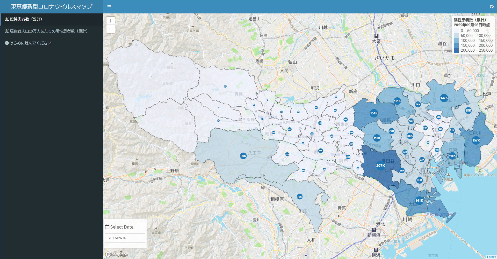

# 東京都新型コロナウイルスマップ

## Shinyウェブアプリケーション

東京都区市町村別の新型コロナウイルス陽性患者数（累計）および居住者人口10万人あたりの新型コロナウイルス陽性患者数（累計）の最新のデータを取得し地図上に可視化しています。なお区市町村別の居住者人口は2015年国勢調査（総務省）のデータに基づいています。  
URL: https://keisuke-kondo.shinyapps.io/stopcovid19tokyo/

## 利用規約
当サイトで公開している情報（以下「コンテンツ」）は、どなたでも自由に利用できます。コンテンツ利用に当たっては、本利用規約に同意したものとみなします。本利用規約の内容は、必要に応じて事前の予告なしに変更されることがありますので、必ず最新の利用規約の内容をご確認ください。

### 著作権
本コンテンツの著作権は、近藤恵介に帰属します。

### 第三者の権利
本コンテンツは、「東京都新型コロナウイルス感染症対策サイト」および、「e-Stat 政府統計の総合窓口」の情報に基づいて作成しています。本コンテンツを利用する際は、第三者の権利を侵害しないようにしてください。

### 免責事項
<ul>
<li>作成にあたり細心の注意を払っていますが、本サイトの内容の完全性・正確性・有用性等についていかなる保証を行うものでありません。</li>
<li>本サイトを利用したことによるすべての障害・損害・不具合等、作成者および作成者の所属するいかなる団体・組織とも、一切の責任を負いません。</li>
<li>本サイトは、事前の予告なく変更、移転、削除等が行われることがあります。</li>
</ul>

## データ出所

### 東京都新型コロナウイルス感染症対策サイト
URL: https://stopcovid19.metro.tokyo.lg.jp/

上記サイトの「その他参考指標」より、「陽性患者数（区市町村別）」のデータを使用。

### e-Stat 政府統計の総合窓口
URL: https://www.e-stat.go.jp/

上記サイトより、2015年国勢調査の小地域の境界データより、東京都全域のシェープファイルを使用。作成者によって区市町村別に境界データを加工。

## 作成者
独立行政法人経済産業研究所、上席研究員、近藤恵介  
Email: kondo-keisuke@rieti.go.jp  
URL: https://sites.google.com/site/keisukekondokk/  

## 変更履歴

2021年1月22日　GitHub公開、利用規約改定  
2020年6月27日　Shinyウェブアプリ公開、利用規約公開  
